# Mapillary semantic segmentation availability survey

Run: 2026-09-23 15:20 → 2026-09-23 15:29 (UTC). Generated by `scripts/segmentation_survey.py`.

For each location, every image of the zoom-14 coverage vector tile (~2.4 km) containing it was listed and split by capture epoch; in each location × epoch, up to a few images (preferring distinct sequences) were sampled and their detections were requested from `https://graph.mapillary.com/{image_id}/detections`.

- **% with detections**: images for which the API returned at least one detection.
- **% with full-scene classes**: images with at least one *surface* class (`construction--*`, `nature--*`, `void--*`), i.e. a real semantic segmentation rather than only object, road-marking or traffic-sign detections.
- **Latest detection created_at**: when Mapillary produced the newest detection of the group (processing date, not capture date).

## Overview

- Cells (location × epoch): 352, with imagery: 291
- Images sampled: 865 (failed requests: 0)
- Images with detections: 720
- Images with full-scene segmentation classes: 513
- Geometry decode failures: 0
- Newest detection created_at: 2026-09-17
- Orientation check (sky centroid above road centroid): {'True': 451}

## API probes

Search strategy: **all images of the zoom-14 coverage vector tile around each location, split into epochs by captured_at**

| probe                                                    | ok    |   images | error                                                                                                                                                                                                                                                                                         |
|:---------------------------------------------------------|:------|---------:|:----------------------------------------------------------------------------------------------------------------------------------------------------------------------------------------------------------------------------------------------------------------------------------------------|
| coverage vector tile (zoom 14)                           | True  |    83839 |                                                                                                                                                                                                                                                                                               |
| /images bbox search, ±0.01°, fields=id, limit=10         | False |        0 | Failed to fetch data from Mapillary API: 500 Server Error: Internal Server Error for url: https://graph.mapillary.com/images?bbox=-49.2833%2C-25.4384%2C-49.2633%2C-25.4184&limit=10&access_token=***&fields=id (Please reduce the amount of data you're asking for, then retry your request) |
| /images bbox search, ±0.001°, fields=id, limit=10        | True  |       10 |                                                                                                                                                                                                                                                                                               |
| /images bbox search, ±0.001°, with start/end_captured_at | True  |        7 |                                                                                                                                                                                                                                                                                               |

## By capture epoch

| epoch     |   Images |   Failed requests |   % with detections |   % with full-scene classes |   Median classes | Latest detection created_at   |
|:----------|---------:|------------------:|--------------------:|----------------------------:|-----------------:|:------------------------------|
| 2014-2015 |       72 |                 0 |                73.6 |                        23.6 |              2   | 2025-08-19                    |
| 2016-2017 |       89 |                 0 |                70.8 |                        20.2 |              2   | 2024-05-27                    |
| 2018      |       96 |                 0 |                63.5 |                        14.6 |              1   | 2024-05-26                    |
| 2019      |       86 |                 0 |                74.4 |                        19.8 |              2   | 2024-05-26                    |
| 2020      |       66 |                 0 |                68.2 |                        21.2 |              2   | 2024-05-18                    |
| 2021      |       69 |                 0 |                68.1 |                        66.7 |             18   | 2024-05-18                    |
| 2022      |       72 |                 0 |               100   |                       100   |             21.5 | 2024-06-16                    |
| 2023      |       76 |                 0 |               100   |                       100   |             22.5 | 2025-05-29                    |
| 2024      |       84 |                 0 |               100   |                       100   |             21   | 2025-01-03                    |
| 2025      |       85 |                 0 |               100   |                       100   |             22   | 2026-06-23                    |
| 2026      |       70 |                 0 |               100   |                       100   |             21.5 | 2026-09-17                    |

## By continent

| continent     |   Images |   Failed requests |   % with detections |   % with full-scene classes |   Median classes | Latest detection created_at   |
|:--------------|---------:|------------------:|--------------------:|----------------------------:|-----------------:|:------------------------------|
| South America |      135 |                 0 |                86.7 |                        51.9 |               10 | 2026-08-24                    |
| North America |      124 |                 0 |                92.7 |                        85.5 |               24 | 2026-09-06                    |
| Europe        |      253 |                 0 |                85   |                        61.3 |               15 | 2026-09-17                    |
| Africa        |       80 |                 0 |                75   |                        43.8 |                3 | 2026-02-22                    |
| Asia          |      207 |                 0 |                78.3 |                        55.6 |               12 | 2026-08-12                    |
| Oceania       |       66 |                 0 |                77.3 |                        48.5 |                8 | 2026-07-10                    |

## Detection processing year (newest detection per image)

|   Year |   Images |
|-------:|---------:|
|   2021 |      248 |
|   2022 |       71 |
|   2023 |      115 |
|   2024 |      125 |
|   2025 |       89 |
|   2026 |       72 |

## Share of sampled images with detections, per location and epoch

`·` = no imagery found for that epoch, `err` = requests failed.

| location      | 2014-2015   | 2016-2017   | 2018   | 2019   | 2020   | 2021   | 2022   | 2023   | 2024   | 2025   | 2026   |
|:--------------|:------------|:------------|:-------|:-------|:-------|:-------|:-------|:-------|:-------|:-------|:-------|
| Curitiba      | 67%         | 100%        | 100%   | 100%   | ·      | 100%   | 100%   | 100%   | ·      | ·      | 100%   |
| São Paulo     | 100%        | 100%        | 67%    | 67%    | 33%    | 0%     | ·      | 100%   | 100%   | 100%   | 100%   |
| Buenos Aires  | 67%         | 67%         | 33%    | 33%    | 100%   | ·      | 100%   | 100%   | 100%   | 100%   | ·      |
| Bogotá        | 100%        | 33%         | 100%   | 100%   | ·      | 100%   | 100%   | 100%   | 100%   | 100%   | 100%   |
| Lima          | ·           | 67%         | 67%    | 100%   | ·      | ·      | 100%   | 100%   | 100%   | 100%   | 100%   |
| Mexico City   | 67%         | 67%         | 67%    | 0%     | 100%   | 0%     | ·      | 100%   | 100%   | 100%   | 100%   |
| San Francisco | 100%        | 100%        | 100%   | 100%   | 100%   | 100%   | 100%   | 100%   | 100%   | 100%   | 100%   |
| New York      | 100%        | 100%        | 100%   | 100%   | 100%   | 100%   | 100%   | 100%   | 100%   | 100%   | 100%   |
| Toronto       | 100%        | 100%        | 100%   | 100%   | 100%   | 100%   | 100%   | 100%   | ·      | 100%   | 100%   |
| London        | 100%        | 100%        | 67%    | 100%   | 100%   | 100%   | 100%   | 100%   | 100%   | 100%   | 100%   |
| Paris         | 0%          | 67%         | 100%   | 100%   | 67%    | 0%     | 100%   | 100%   | 100%   | 100%   | 100%   |
| Berlin        | 67%         | 67%         | 33%    | 67%    | 33%    | 67%    | 100%   | 100%   | 100%   | 100%   | 100%   |
| Madrid        | 100%        | 100%        | 67%    | 67%    | 100%   | 100%   | 100%   | 100%   | 100%   | 100%   | 100%   |
| Stockholm     | 0%          | 100%        | 100%   | 100%   | 67%    | 0%     | 100%   | 100%   | 100%   | 100%   | 100%   |
| Warsaw        | 100%        | 100%        | 67%    | 67%    | 67%    | 0%     | 100%   | 100%   | 100%   | 100%   | 100%   |
| Rome          | 100%        | 100%        | 100%   | 100%   | ·      | ·      | 100%   | 100%   | 100%   | 100%   | 100%   |
| Istanbul      | 67%         | 33%         | 100%   | 67%    | 33%    | 100%   | 100%   | 100%   | 100%   | 100%   | ·      |
| Cairo         | ·           | 67%         | 33%    | 100%   | 33%    | 33%    | ·      | 100%   | 100%   | 100%   | ·      |
| Casablanca    | ·           | ·           | 67%    | 33%    | ·      | ·      | ·      | ·      | ·      | ·      | ·      |
| Lagos         | ·           | 100%        | 33%    | ·      | ·      | ·      | ·      | 100%   | 100%   | 100%   | ·      |
| Nairobi       | 67%         | 33%         | 33%    | 100%   | 67%    | ·      | ·      | 100%   | 100%   | 100%   | 100%   |
| Johannesburg  | ·           | 50%         | 67%    | ·      | ·      | ·      | ·      | ·      | 100%   | 100%   | ·      |
| Dubai         | 100%        | 33%         | 33%    | 67%    | 100%   | 100%   | 100%   | 100%   | 100%   | 100%   | 100%   |
| Mumbai        | ·           | 33%         | 33%    | 0%     | ·      | 100%   | 100%   | ·      | 100%   | 100%   | 100%   |
| Bangkok       | 100%        | 33%         | 67%    | 67%    | 33%    | 100%   | 100%   | ·      | 100%   | 100%   | 100%   |
| Jakarta       | 33%         | ·           | 67%    | 67%    | ·      | ·      | 100%   | 100%   | 100%   | 100%   | ·      |
| Singapore     | 100%        | 100%        | 0%     | 0%     | ·      | ·      | ·      | ·      | ·      | ·      | ·      |
| Manila        | ·           | 67%         | 67%    | 100%   | 100%   | 100%   | 100%   | ·      | 100%   | 100%   | 100%   |
| Seoul         | ·           | 33%         | 0%     | ·      | 33%    | 100%   | 100%   | 100%   | 100%   | 100%   | 100%   |
| Tokyo         | 0%          | 33%         | 100%   | 100%   | 0%     | 100%   | 100%   | 100%   | 100%   | 100%   | 100%   |
| Sydney        | 67%         | 67%         | 33%    | 100%   | 67%    | 0%     | 100%   | 100%   | 100%   | 100%   | 100%   |
| Auckland      | 67%         | 67%         | 33%    | 67%    | 67%    | 67%    | 100%   | 100%   | 100%   | 100%   | 100%   |

## Samples

Left: image thumbnail. Right: decoded segmentation overlay.

**San Francisco, captured 2015-08-16 (detections created 2023-10-16)**, image `232505111972649`, 26 classes

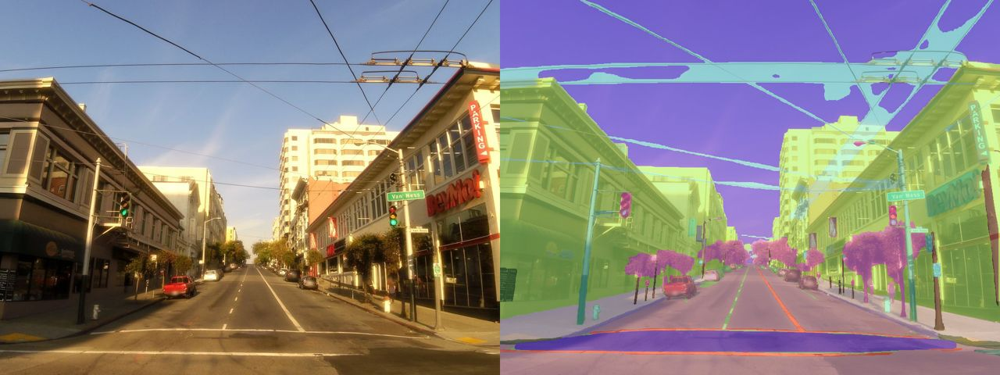

**Sydney, captured 2016-08-16 (detections created 2024-04-28)**, image `125679006192899`, 15 classes

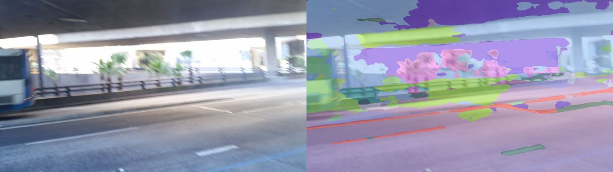

**New York, captured 2018-10-07 (detections created 2023-10-19)**, image `3400138916755774`, 24 classes

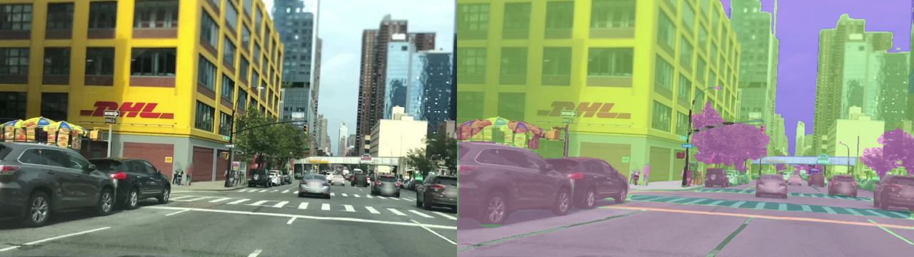

**Lima, captured 2019-03-06 (detections created 2021-05-23)**, image `228601735273689`, 10 classes

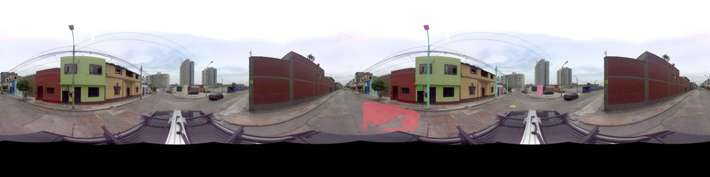

**Toronto, captured 2020-01-22 (detections created 2024-05-18)**, image `2817119065266192`, 33 classes

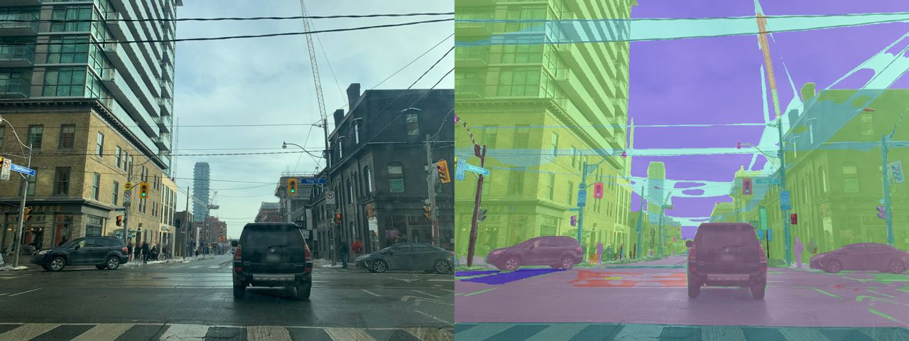

**San Francisco, captured 2021-12-14 (detections created 2021-12-15)**, image `239914054783070`, 18 classes

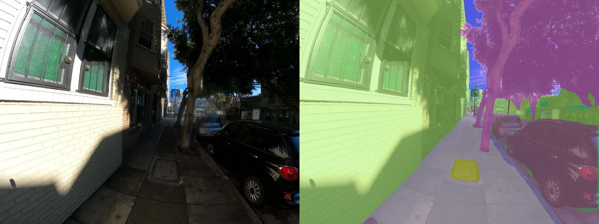

**New York, captured 2022-02-02 (detections created 2022-05-07)**, image `695181145067088`, 30 classes

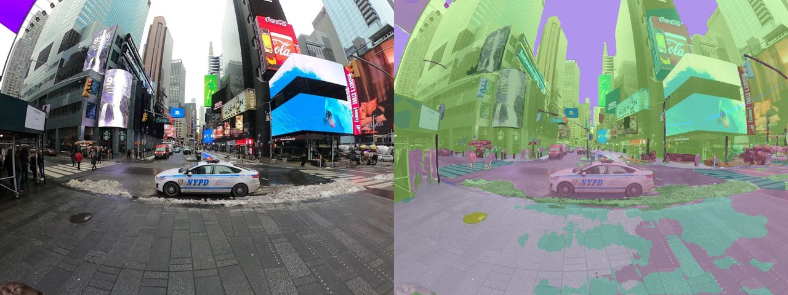

**Nairobi, captured 2023-02-11 (detections created 2023-03-15)**, image `202712652360176`, 21 classes

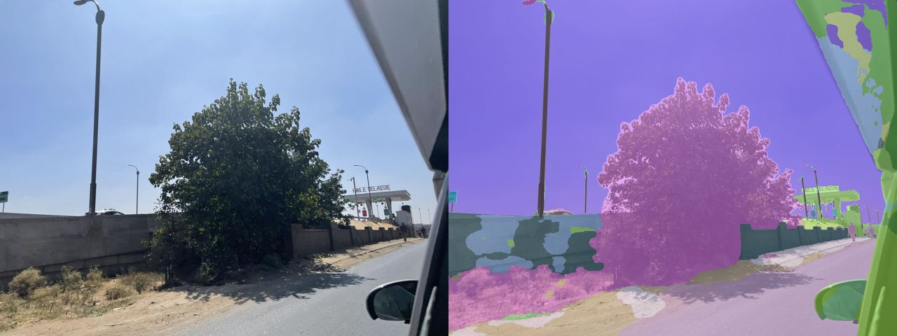

**São Paulo, captured 2024-03-13 (detections created 2024-05-02)**, image `427077553249227`, 24 classes

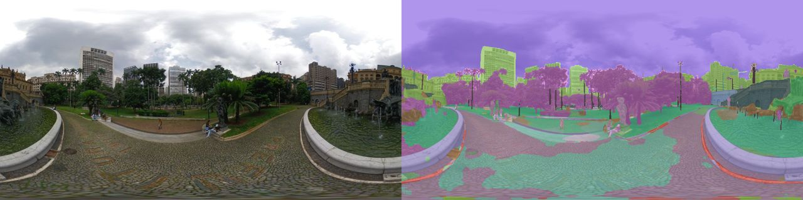

**Mexico City, captured 2025-03-21 (detections created 2025-03-22)**, image `1360089865004927`, 27 classes

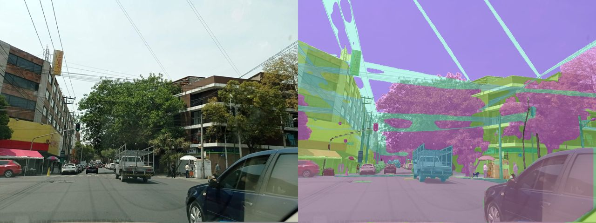

**Bogotá, captured 2026-02-12 (detections created 2026-05-26)**, image `2441739009661944`, 23 classes

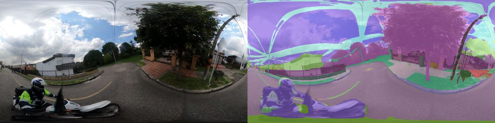

**London, captured 2015-07-21 (detections created 2023-10-12)**, image `1328164027567200`, 14 classes

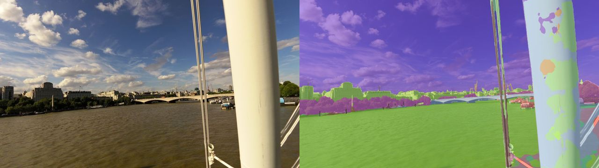
